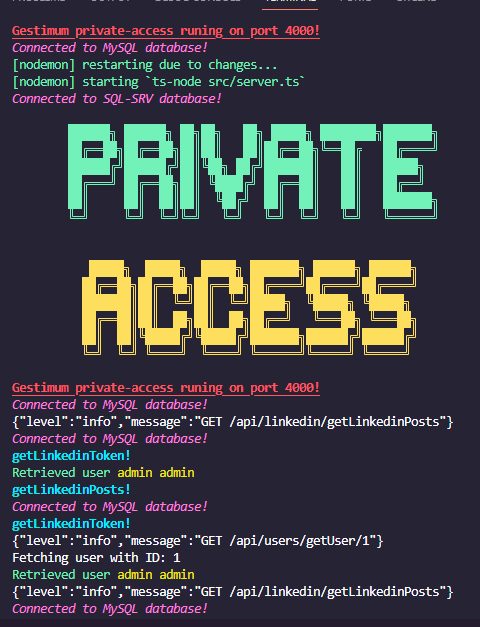

# Espace Privé Gestimum 2024

Le nouvel espace privé Gestimum pour 2024, avec toutes les ressources à jour.


## Screenshots




## Demo

https://github.com/Thomasjan/private-access-client

https://github.com/Thomasjan/private-access-api


## Environment Variables

.env file:

`DATABASE_HOST`

`DATABASE_USER`

`DATABASE_PASSWORD`

`DATABASE_NAME`


`MAIL_DRIVER`

`MAIL_HOST`

`MAIL_PORT`

`MAIL_USER`

`MAIL_PASSWORD`


`DB_CONNECTION_SQLSRV`

`DB_HOST_SQLSRV`

`DB_PORT_SQLSRV`

`DB_DATABASE_SQLSRV`

`DB_USERNAME_SQLSRV`

`DB_PASSWORD_SQLSRV`


`LINKEDIN_ACCESS_TOKEN`

`TOKEN_SECRET`


`ERP_API_URL`

`SERVER_URL`

`APP_URL`


## Tech Stack

**API:** Node, Express, Typescript


## Run Locally

Clone the project

```bash
  git clone https://link-to-project
```

Go to the project directory

```bash
  cd my-project
```

Install dependencies

```bash
  npm install
```

Start the server

```bash
  npm run start
```


## Authors

- [@ThomasJan](https://github.com/Thomasjan)
